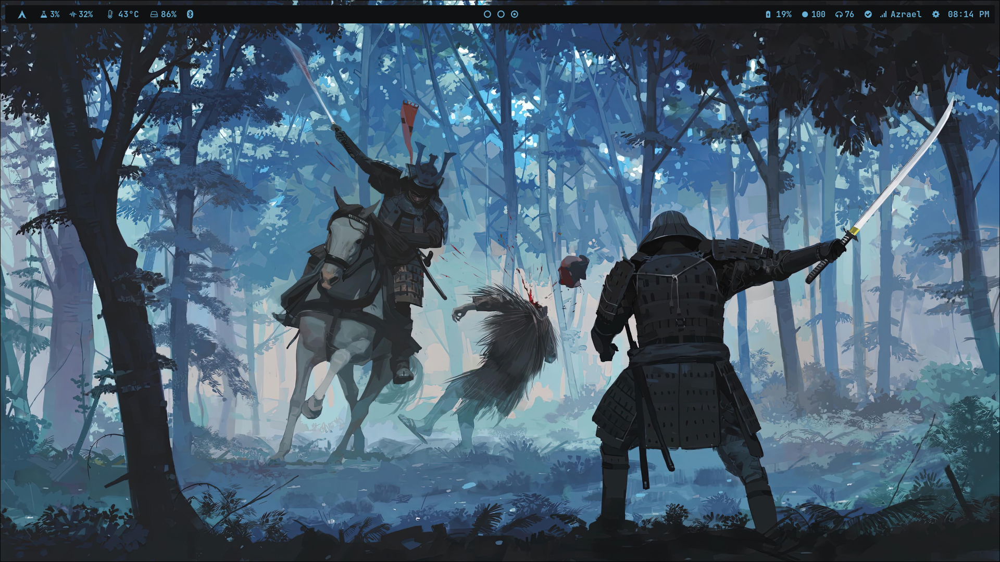

# The dots are incomplete

# 💠 Dot Files 💠

  

 

## Hypr Config 3.0
 

 

https://github.com/Knightfall01/Hyprland-i3/assets/107239398/b5329cb4-7e7f-47b7-92b4-edceeeeee452

### Tokyo Night themed Kitty Terminal Color Schemes

To use the Tokyo Night color scheme for your terminal, consider removing or relocating the existing `kitty-theme.conf` file,
and then proceed to rename the `kitty-theme.conf.tokyonight` accordingly.

  

# Details
- **OS**: Arch Linux
- **Compositor**: [Hyprland](https://github.com/hyprwm/Hyprland)
- **Top Bar**: [Waybar](https://github.com/Alexays/Waybar/)
- **Notifications**: [dunst](https://github.com/dunst-project/dunst)
- **Wallpaper**: `/Wallpapers/samurai_strike`
- **Terminal**: [kitty](https://github.com/kovidgoyal/kitty)
- **Search menu**: [wofi](https://github.com/uncomfyhalomacro/wofi)
- **Fetch script**: `Neofetch`
- **Themes**: `Use the waybar config as configcat and stylecss as stylecat`

