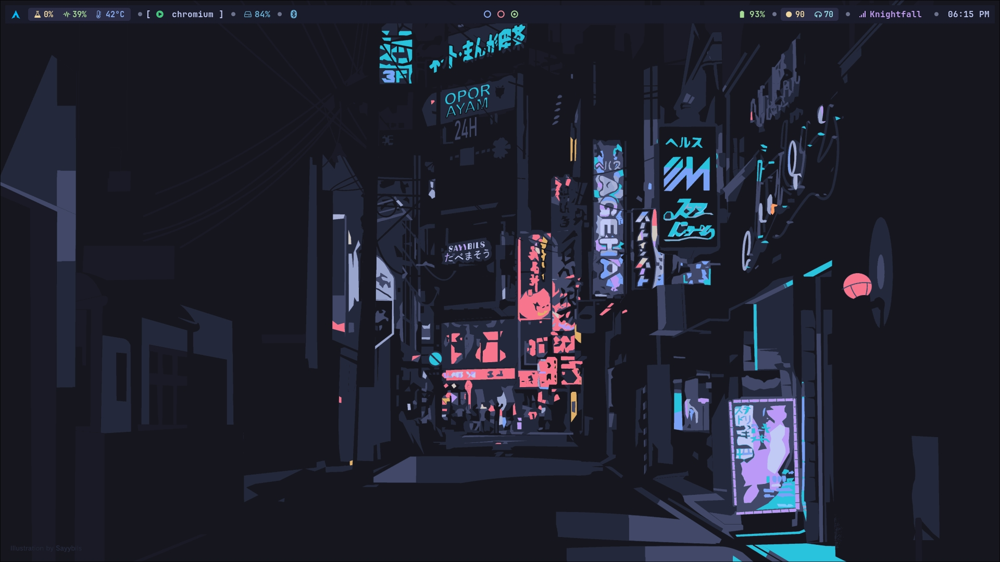
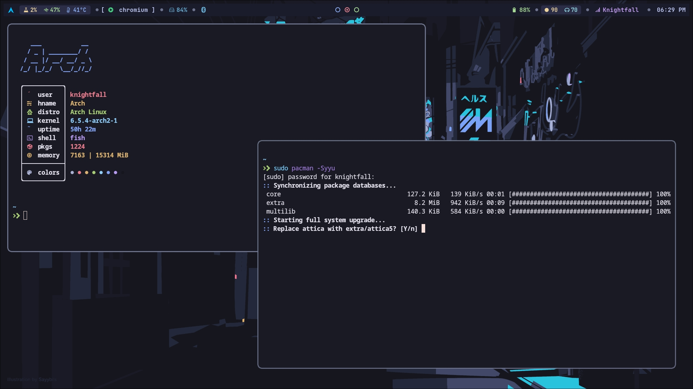
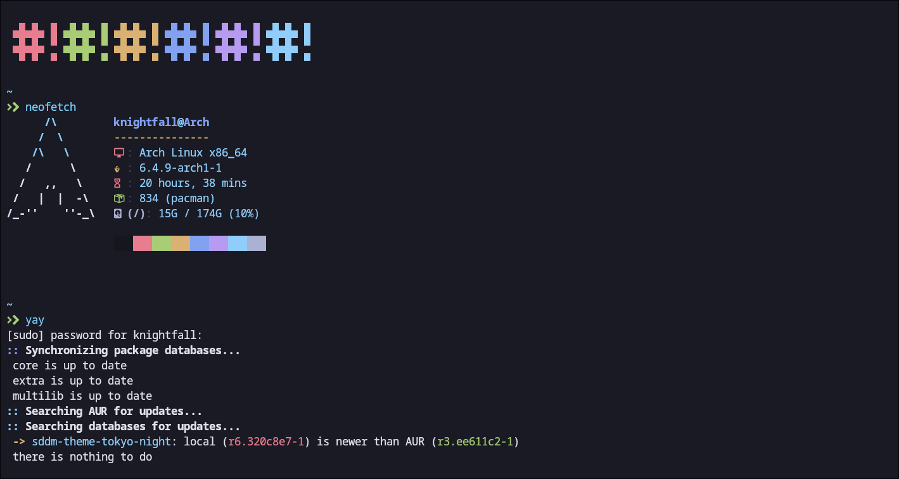

<!-- # By knightfall01 on Github as a part of https://github.com/Knightfall01/Hyprland-config -->

# 💠 Dot Files - Hypr Config 3.0 💠

   

 

 

 

 

### Tokyo Night Kitty Terminal Color Scheme

### Waybar Configs:

#### Config 3.0

 

#### Old Config

 

 Replace the `config-3.0` in the hypr config with `tokyonightconfig and tokyonightstyle.css` to use the old configuration. 

# Details
- **OS**: Arch Linux
- **Compositor**: [Hyprland](https://github.com/hyprwm/Hyprland)
- **Top Bar**: [Waybar](https://github.com/Alexays/Waybar/)
- **Notifications**: [dunst](https://github.com/dunst-project/dunst)
- **Wallpaper**: `../wallpaper/street-tn.png`
- **Terminal**: [kitty](https://github.com/kovidgoyal/kitty)
- **Search menu**: [wofi](https://github.com/uncomfyhalomacro/wofi)
- **Fetch script**: `Neofetch`
- **Themes**: `Use the waybar config as configcat and stylecss as stylecat`

